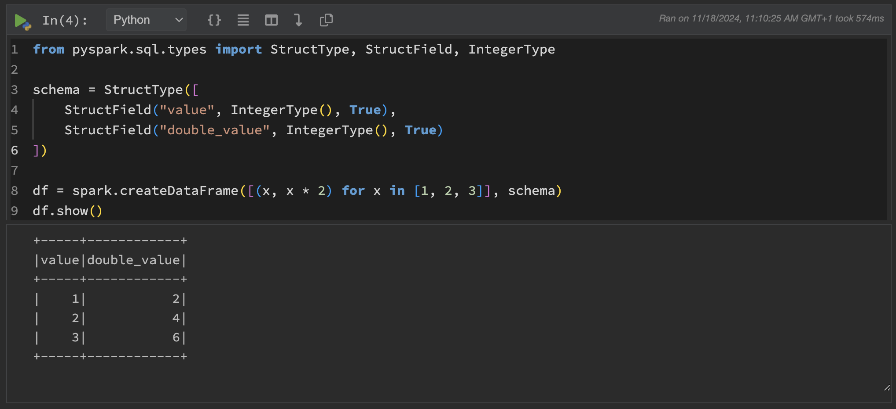

# Polynote
[Polynote](https://polynote.org/latest/) is an open-source polyglote notebook that provides support for Scala and integration with Apache Spark. It's main feature is multi-language interoperability between Scala, Python, SQL and [Vega](https://vega.github.io/vega/), where dataframes and variables can be shared across languages in the same notebook. Polynote supports the popular `.ipynb` notebook file format, making it easy to use notebooks created in other environments, like Jupyter.

## Initialization
For information on how to use the Initialization parameter, please refer to the [Initialization: Bash Script](https://docs.cloud.sdu.dk/hands-on/init-sh.html) section of the documentation.

## Configuration
By default, the configuration file is located in `/opt/polynote/conf.yml` and can be edited directly by using the app's terminal interface. Nevertheless, for the changes to take effect, you must stop the Polynote process and start it again:

```console
$ kill <polynote-process-id>
$ python3 /opt/polynote/polynote.py
```

A custom conf.yml file can be loaded before the job starts using the optional Polynote _configuration_ parameter. 

It is important to note that the conf.yml file must contain the following lines in order to launch the app's interface:
```{console}
# ...

###############################################################################
# The host and port can be set by uncommenting and editing the following lines.
###############################################################################

listen:
  host: 0.0.0.0
  port: 8192

# ...

```

Additionally, each Notebook has it's own configuration that can be modified while editing. Changing this configuration does not require a restart of the Polynote process.

## Getting started
In the following sections we highlight some of Polynote's features. For a basic understanding on how Polynote works and more information about the topic, check out the [official documentation](https://polynote.org/latest/docs/basic-usage/).

### Working with Notebooks
As mentioned earlier, Polynote uses `.ipynb` files, which is similar to environments like Jupyter. Nevertheless, there are a few key differences that should be taken in consideration. In Polynote, cell execution order is especially important: cells can be re-executed independently, but any cell that depends on a modified cell will automatically update, minimizing the need for rerruning entire sequences manually. Unlike Jupyter, which requires different kernels to run different languages, Polynote allows each cell to be written in a different language while seamlessly sharing data between cells.

Polynote offers a `config.yml` file for global settings, but each notebook can also have its own configuration for JVM and Python dependencies, Spark settings and kernel configuration. This per-notebook configuration makes it easy to manage environments without impacting other notebooks and while maintaining a cleaner more organized code. Additionally, Polynote allows for easy "Copy and paste" of configuration between notebooks.

```note
JVM dependencies are specified in `GAV` notation and resolved by `Coursier`, while Python dependencies are handled by `pip`. Dependencies can also be listed in a `.txt` file, being automatically cached by Polynote.
```
For more information about the configuration options, refer to Polynote's [Notebook configuration documentation](https://polynote.org/latest/docs/notebook-configuration/).

### Using multiple languages
Polynote supports value sharing across different language cells. This means, for example, a DataFrame defined in a Scala cell can be used in a Python cell, and so forth. Primitive data types and structures (such as strings, integers, arrays and dataframes) are most commonly shared, while more complex objects may require serialization.

For more information refer to the [official documentation](https://polynote.org/latest/docs/mixing-programming-languages/).

## Submit a Spark Application
Polynote is deeply integrated with Apache Spark, making it well-suited for distributed data processing and big data workflows. By default, the Polynote app in U-Cloud comes with Spark already installed, meaning you can immediately start running Spark applications locally. For larger datasets, Polynote also supports running applications in cluster mode. 

The following subsections show an example of how to configure and run Spark jobs from a Polynote App.

```note
The configuration shown below can be specified either in the `config.yml` file, for all notebooks, or in the Configuration section found at the top of each individual notebook.
```

Once configured, Spark can be used directly in a Python or Scala cell like so:




```note
Polynote creates and manages the SparkSession internally, so it is available across all cells in a notebook. You can access it by using the `spark` variable in both Python and Scala cells.
```

For more information on Spark in Polynote, refer to the [official documentation](https://polynote.org/latest/docs/spark/).


### Local Deployment Configuration
For smaller/sampled datasets it is convenient to run Spark applications in local mode, that is using only the resources allocated to the Polynote app and the local installation of Spark. To enable Spark within your notebook, make sure you have at least one Spark property set in Polynote's Spark configuration. No extra set up is needed. An example of a configured property is the following:


### Cluster Deployment Configuration
Spark applications which require distributed computational resources can be submitted directly to a [Spark standalone cluster](https://docs.cloud.sdu.dk/Apps/spark-cluster.html), which allows to distribute data processing tasks across multiple nodes. In this case, the Polynote app should be connected to a Spark cluster instance using the optional parameter [Connect to other jobs](https://docs.cloud.sdu.dk/guide/submitting.html#connect-to-other-jobs), as shown in the following example:


where the Job entry is used to select the job ID of the Spark Cluster instance, created in advance. Besides, the Hostname parameter is employed to assign the URL of the master node in Polynote's Spark configuration. The default port on the master node is 7077. 


### Spark Application example
Following [JupyterLab's example](https://docs.cloud.sdu.dk/Apps/jupyter-lab.html#cluster-deployment), the equivalent in Polynote is the following:

```{console}
import os

from random import random
from operator import add

os.mkdir('/work/spark_logs')

partitions = 100000
n = 100000 * partitions

def f(_):
    x = random()
    y = random()
    return 1 if x ** 2 + y ** 2 <= 1 else 0

count = spark.sparkContext.parallelize(range(1, n + 1), partitions).map(f).reduce(add)

print("Pi is roughly %f" % (4.0 * count / n))
```

Code will be independent of the deployment mode and configuration used:
- **To run locally**, follow the instructions in [Local Deployment Configuration](#local-deployment-configuration). 
- **To run in cluster mode**, use the configuration shown in the screenshot from [Cluster Deployment Configuration](#cluster-deployment-configuration). 
- **To add additional configuration**, press the `+` button after the last Spark property.


